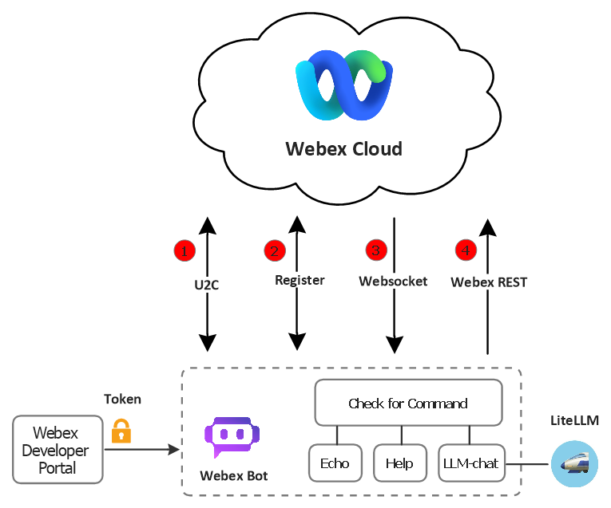
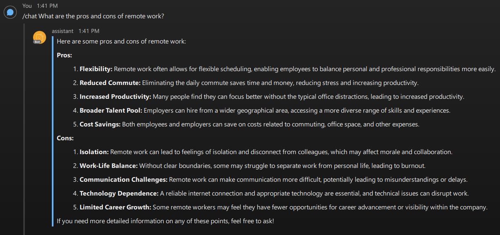
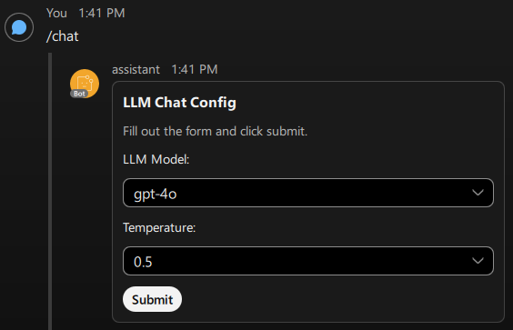
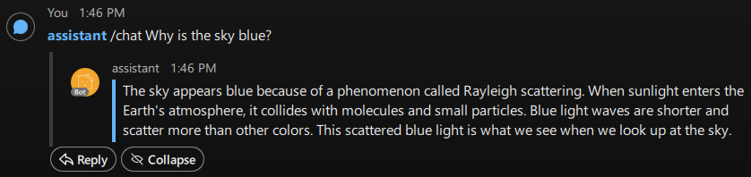

# Webex-Assistant

This project enables user interaction through the Webex messaging interface by deploying a programmable bot that responds to user-defined commands. This bot functions as an automated participant in Webex rooms, capable of joining conversations, posting messages, and executing tasks based on specific user instructions. The assistant acts as an interface to trigger backend processes, query services, or retrieve contextual information.

At its core, the project provides a flexible framework where users can extend the bot's functionality by defining new commands and associated actions. These actions can range from retrieving data from internal systems to invoking workflows in external tools such as GitHub, Jira, Jenkins, or custom automation pipelines. This automated solution reduces manual steps, and improving productivity in team collaboration environments.

## Communication Channel to Webex Cloud

We need a way for the Webex cloud to notify our bot of real-time events, such as when a user sends it a message. There are two approaches for establishing this communication: Webhooks or Websockets.

### Webhooks

A webhook is an HTTP callback that Webex uses to notify your application when a specific event occurs such as receiving a new message or being added to a space. Webhooks work by registering a publicly accessible URL that Webex can send POST requests to when the subscribed event happens. You can [create webhooks](https://developer.webex.com/meeting/docs/api/v1/webhooks/create-a-webhook) using the Webhooks API by specifying the resource (e.g., messages) and the event (e.g., created). Webhooks support near real-time event delivery.

To use webhooks, your bot server must be reachable from the internet, which usually requires a static public IP or DNS record and a proper Firewall/NAT configuration. If you're developing locally, you'll need a tunneling service like `ngrok` to expose your local server to the internet and receive events from the Webex cloud.

### WebSocket

The second and more advanced approach is to connect your bot directly to Webex’s `Mercury` WebSocket service, which allows you to receive real-time events over a persistent connection without needing a public server or external webhook infrastructure.

The WebSocket-based approach offers several advantages over traditional webhook mechanisms when building a Webex bot. Most notably, it eliminates the need for a publicly accessible server or tunneling tools like `ngrok`. This means your bot can operate entirely within a local or private network (securely behind NAT or a firewall) without any external exposure. This simplifies deployment and is particularly beneficial in enterprise environments where inbound HTTP access is restricted or discouraged for security reasons.

Additionally, WebSockets provide a persistent, low-latency communication channel between your bot and the Webex cloud. Unlike webhooks, which rely on stateless HTTP callbacks that must be reestablished for every event, a WebSocket connection remains open, allowing events to be pushed to the bot instantly as they occur. This persistent connection also supports bi-directional communication, enabling the bot not only to receive messages and event notifications but also to send data or commands in real time on the same channel.

This approach is especially well-suited for interactive bots, assistants, and monitoring tools that require real-time responsiveness and tight control over their execution environment. Whether you're building a chatbot that needs to respond instantly to user input or a bot that monitors events and reacts proactively, WebSocket communication ensures your application remains responsive, efficient, and operationally self-contained.

## System Architecture

In this project, we are using the WebSocket approach illustrated in picture below:



- **Step 1**: Contact U2C (User-to-Cluster) to Discover Regional Cluster

    Webex operates on a globally distributed infrastructure, with multiple regional clusters optimized for latency, reliability, and compliance. To determine which cluster a bot or client should interact with, Webex provides the U2C (User-to-Cluster) service. By querying the U2C endpoint, a client receives a set of region-specific service endpoints, such as the Webex Device Management (WDM). This discovery step ensures that the bot communicates with the appropriate data center, reducing latency and meeting compliance or data residency requirements.

- **Step 2**: Register Bot as a Device Using WDM (Webex Device Management)

    After discovering the appropriate WDM endpoint from the U2C service, the bot must register itself as a "device" by calling the `POST /devices` endpoint. This process is similar to how Webex desktop and mobile clients register their presence. The response includes a comprehensive device_info JSON object containing a unique device identifier, supported service URLs, configuration details, and the WebSocket URL for real-time communications. Device registration is a required step for enabling push-based event delivery, as Webex’s real-time messaging layer associates events with specific registered device sessions.

- **Step 3**: Connect to WebSocket

    Using the WebSocket URL obtained during device registration, the bot establishes a persistent connection to the Webex's real-time messaging backbone (a.k.a `Mercury` service). This connection enables the bot to receive push notifications for events such as messages, typing indicators, and membership changes. After establishing the connection, the bot sends an authorization message (containing the access token) to authenticate the WebSocket session. Once authenticated, Webex begins streaming event notifications to the bot, enabling immediate, event-driven workflows without the need for polling the REST API.

    With the WebSocket connection active, the bot can now participate in low-latency communication with Webex. When a user sends a message to the bot, the Webex cloud pushes a notification through the established WebSocket connection. The bot parses this event, extracts context such as the sender and message content, and takes appropriate actions. The use of WebSocket ensures real-time responsiveness and efficient handling of asynchronous interactions between users and the bot.

- **Step 4**: Interact with Webex via REST API

    While the WebSocket channel is used to receive events from Webex, outbound interactions (like sending a message, replying to a thread, or updating a card) are handled through the Webex REST API provided as part of [webexpythonsdk](https://github.com/WebexCommunity/WebexPythonSDK) package. The bot uses endpoints such as `POST /messages` to send text or adaptive card responses based on the event it receives. The Webex REST API also enables the bot to retrieve message history, manage memberships, or access user and space metadata as needed. This dual-approach (WebSocket for inbound and REST for outbound) results in a clean, efficient architecture that is both responsive and scalable.

### WebSocket Message Structure

The general structure of a received message over the WebSocket looks like this:

```python
msg = {
  "data": {
    "activity": { ... },
    "eventType": "conversation.activity"
  }
}
```

The `msg["data"]` object contains the real-time event payload, and within that, the activity object describes what occurred. The activity object has the following data:

| Field             | Description                                                     |
|-------------------|-----------------------------------------------------------------|
| `id`              | Unique ID of the activity (event instance)                      |
| `objectType`      | Always "activity" - indicates this is an action or event        |
| `verb`            | Describes what type of action occurred (next table)             |
| `actor`           | The person who performed the action (sender ID, name, email)    |
| `object`          | The content or object that was affected by the activity         |
| `target`          | The space or conversation where the activity took place         |
| `published`       | ISO timestamp of when the event occurred                        |

The bot is purpose-built as a message-processing assistant, focusing on handling key user interactions such as incoming messages, file shares, Adaptive Card submissions, and specific content updates. Other activity types, such as membership changes or read receipts, fall outside the scope of its core responsibilities and are therefore not processed. The table below outlines the specific verb types the bot actively supports.

| Verb          | Meaning                                                              | Used by Bot   |
|---------------|----------------------------------------------------------------------|---------------|
| `post`        | A user posted a new message in a space (direct or group)             | `Yes`         |
| `share`       | A user shared a file or content                                      | `Yes`         |
| `update`      | A space or object (like a card or message) was updated               | `Yes`         |
| `cardAction`  | A user clicked a button on an Adaptive Card (e.g., Submit action)    | `Yes`         |
| `delete`      | A message or file was deleted                                        | No            |
| `add`         | A user was added to a space                                          | No            |
| `leave`       | A user left a space                                                  | No            |
| `acknowledge` | A read receipt or message acknowledgment was registered              | No            |

### Bot Commands

The bot continuously listens for incoming events and responds based on the activity type (verb). Users can define custom commands that instruct the bot to execute specific actions and return a response. Each command is associated with a configurable keyword. By convention, keywords begin with a forward slash (e.g., `/ask`, `/status`) to make them easily recognizable within normal conversation text. This convention helps distinguish bot commands from general user messages.

Keyword matching can be configured for either exact or partial matches, allowing for flexible interaction patterns. Once triggered, the command performs the designated action such as querying a service, executing a workflow, or retrieving contextual data and returns the result directly within the Webex space.

In addition to plain text responses, commands can also return Adaptive Cards to display structured information or collect user input interactively. This enables a rich, conversational experience by allowing users to submit forms, make selections, or trigger follow-up actions directly through the Webex interface.

### Adaptive Cards

[Adaptive Cards](https://www.adaptivecards.io) are an open, platform-agnostic framework developed by Microsoft for rendering rich interactive UI content within applications. They allow developers to create dynamic card-based UIs using a JSON schema. These cards are rendered natively by host applications, such as messaging platforms or dashboards, ensuring consistent appearance and behavior across ecosystems.

The core idea behind Adaptive Cards is interoperability. Rather than building platform-specific UI components, developers can write a single card definition in JSON and expect it to render similarly across different environments that support the Adaptive Card standard. This design allows for consistent user experiences in platforms like Microsoft Teams, Webex, Outlook, and even custom web or mobile apps that integrate Adaptive Card renderers.

Adaptive Cards are structured using a well-defined schema that includes containers, text blocks, images, buttons, inputs, and layout elements. These components can be combined to create a wide variety of use cases from simple notifications to interactive forms with data submission capabilities. Because the layout is driven by data and rules rather than HTML or proprietary templates, cards can be reused and adapted easily across services and devices.

- Microsoft's [Adaptive Card Designer](https://adaptivecards.io/designer/)
- [Sample](https://adaptivecards.io/samples/Agenda.html) Adaptive Cards

Webex supports Adaptive Cards and uses them to enable interactive, rich message experiences within Webex spaces. Bots and integrations can send Adaptive Cards to Webex rooms, allowing users to interact with forms, buttons, dropdowns, and more, all without leaving the chat interface. Webex bots can also receive card submissions via `cardAction` events, enabling two-way interaction. Note that Webex does not support all features of the Adaptive Cards specification. Its implementation is based on version 1.3 and includes a few important limitations. You can find more information in [here](https://developer.webex.com/messaging/docs/buttons-and-cards).

## Getting Started

You must first register your bot via the [Webex Developer UI](https://developer.webex.com/my-apps/new/bot). When creating a bot, you specify a display name (e.g., `assistant`) and a unique username (e.g., `my-assistant@webex.bot`). The display name determines how your bot appears in Webex spaces, while the username is used to mention or add the bot to conversations. Upon creation, Webex issues a static bot access token, which acts as a credential for all authenticated API requests on behalf of the bot. This token should be stored securely and included in the Authorization header of all subsequent HTTP requests.

Create an `.env` file in the `src` directory of the project and define the `WEBEX_API_TOKEN` environment variable to authenticate API requests. Next, open the [llm_chat.py](/src/commands/llm_chat.py) file and verify that the LiteLLM backend URL is correctly set to point to your running instance.

To build and start the bot container, run the following commands:

```bash
docker compose build
docker compose up -d
```

Monitor the container logs to ensure the bot has started successfully:

```bash
docker logs -f webex-assistant
```

Once running, you can interact with the bot by adding it to your Webex client using its bot username (e.g., `my-assistant@webex.bot`). You may chat with it directly in a one-on-one space.



Typing the `/chat` command opens an Adaptive Card allowing you to configure LLM settings interactively:



The bot can also be added to a group space. In that case, simply mention the bot using `@assistant` followed by your command to interact with it:



To ensure secure usage and prevent unauthorized access, it is strongly recommended to restrict the scope of your bot using one or more of the following options:

- **approved_users**: A list of specific email addresses permitted to interact with the bot.
- **approved_domains**: A list of approved email domains. Only users from these domains can access the bot.
- **approved_rooms**: A list of specific Webex room IDs. Only users in these rooms can send commands to the bot.

If none of these options are specified, the bot will be accessible to any Webex user.
